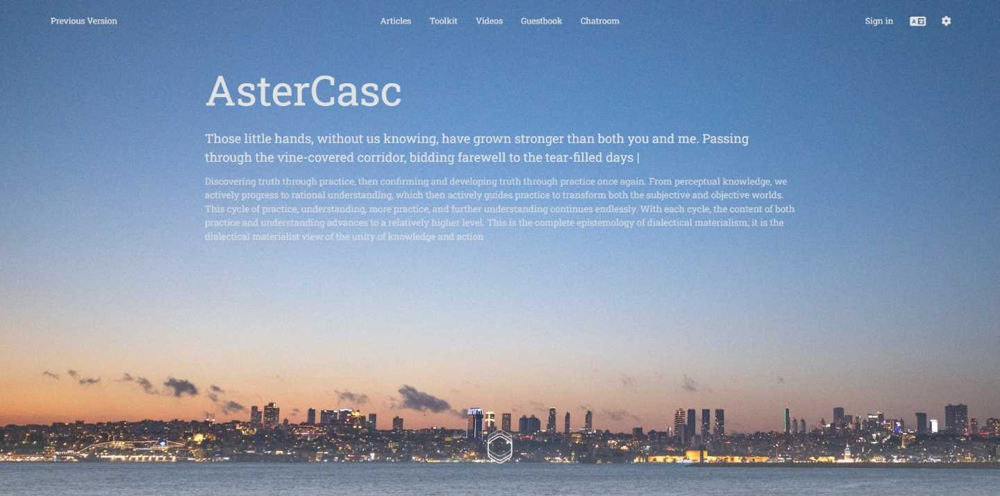
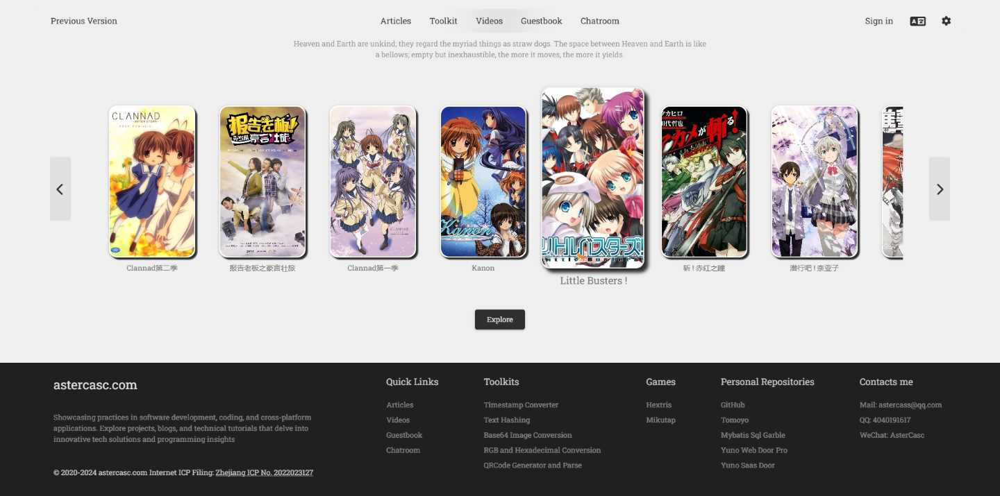
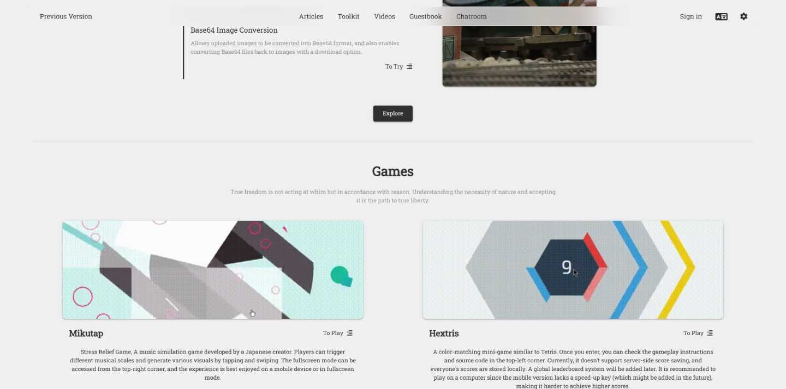
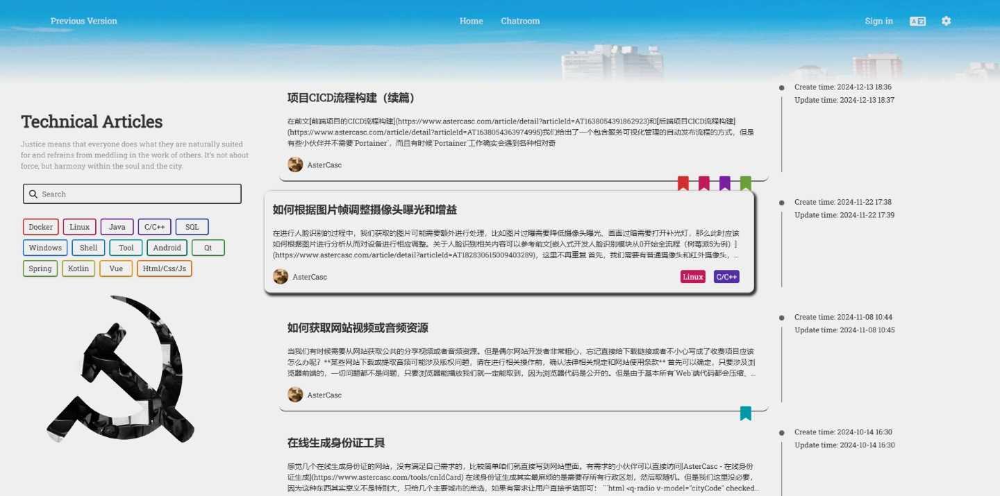
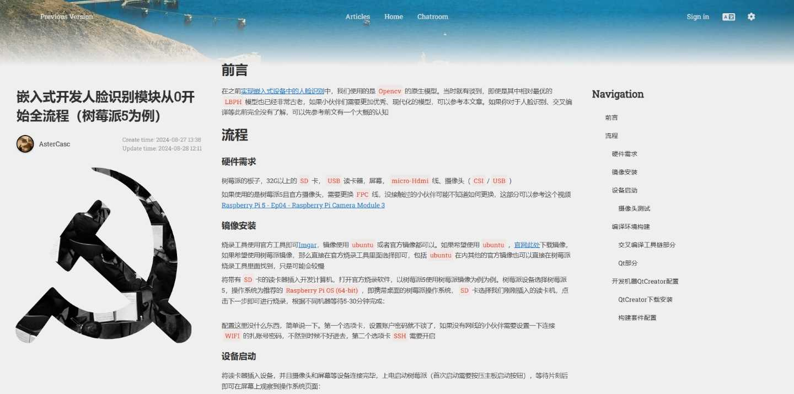
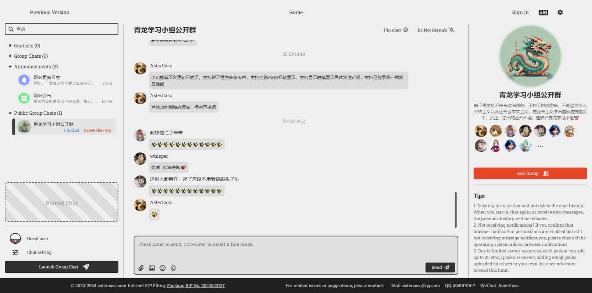

# admin-door-pro

## 启动

```shell
yarn serve
```

## 网站说明

[当前仓库网站地址](https://www.astercasc.com)

预计使用该代码重构该网站主要功能：[旧版本地址](https://previous.astercasc.com) 

[旧版本仓库](https://github.com/AsterCass/yuno-door-web)

## 新版本预览















## 已完成

* 主页
* 文章列表页
* 文章详情页
* 聊天页
* 留言页
* 工具页面
* 个人资料页
* 视频页

## 计划中

* 监控页
* 游戏页

## 项目文件结构

* patches: patch-package 覆写源码包补丁文件
* public: index.html
* src：
    * api：后端接口调用
    * assets: 静态资源文件
    * ui: 页面、视图、组件
    * constants：项目常量文件
    * i18n: 语言
    * mock: 模拟数据
    * options: 配置文件
    * router： 路由
    * styles: 样式文件
    * utils：工具类

## 包引用

* juice: 类样式直接嵌入页面元素（for pdfmkae.js）
* raw-loader: 文件内容读取（for juice.js）
* pdfmake/html-to-pdfmake: pdf生成/转换
* stomp/stompjs：websocket
* qrcode-vue3：二维码生成
* jsqr：二维码解析
* sql-ddl-to-json-schema：DDL转基本json，用于自动生成类
* fontsource/roboto-slab：字体
* quasar/extras：quasar附加功能
* animate.css：动画
* axios：接口调用
* core-js：base
* crypto-js：加密解密
* highlight.js：markdown解析代码高亮
* marked-highlight: markdown解析代码高亮
* marked：markdown解析
* mitt：事件总线
* patch-package：源码补丁
* pinia：本地存储
* qs：接口调用序列化
* quasar：ui美化
* plyr：视频样式封装
* vue3-google-login: 谷歌登录
* vue：vue
* vue-router：vue
* vue-i18n: 多语言支持
* lottie-web: 动画支持

## 注意事项

1. dPlayer的patch
    1. 删除视频右击菜单栏默认选项
    2. 删除默认日志打印提示
    3. 删除视频控制台下`<label for="">`浏览器报错相关代码，其实整个控制台除了进度条可以删除，
       但是一些div和js逻辑有联动会导致项目报错，所以只删除label相关代码
    4. 修改apiUrl的生成逻辑，代码位置：`[]).slice(0);`
       文件位置：[danmaku.js](https://github.com/DIYgod/DPlayer/blob/master/src/js/danmaku.js)，
       修改为apiUrl不使用奇怪的自定义生成逻辑，直接返回videoId
2. qrcode的patch
    1. 禁止输出Suspense实验性提示，即使是在开发环境
3. sockjs-client的patch
    1. 注释`global.addEventListener(event, listener, false);`仅用于构建`SockJS`不需要事件支持，
       并且该种写法已经过时，参考[Window: unload event](https://developer.mozilla.org/en-US/docs/Web/API/Window/unload_event)
       该[issue](https://github.com/sockjs/sockjs-client/issues/646)目前（2024-02-06）处于打开状态，暂未得到回复